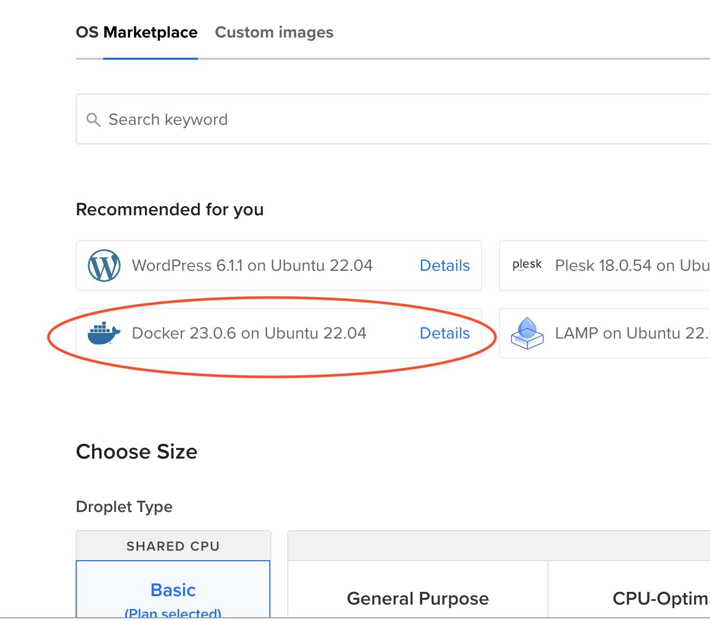

# Setup project for CI/CD

## Part 1 - GitHub workflow pipeline

1. Create a new repository on GitHub and push the project (any javalin project with some tests (First time use a project without database)) to the repository
2. Create a folder in the root of the project called .github/workflows
3. Inside it create a new file called workflow.yml (or any name you want as long as it ends with .yml)
4. Copy the following code into the workflow.yml file

```yaml
name: API JAVALIN WORKFLOW
on:
  push:
    branches: [ main ]
  pull_request:
    branches: [ main ]
jobs:
  build:
    runs-on: ubuntu-latest
    steps:
      -
        name: Checkout
        uses: actions/checkout@v3
      -
        name: Set up JDK 17
        uses: actions/setup-java@v3
        with:
          java-version: '17'
          distribution: 'temurin'
      -
        name: Build with Maven
        run: mvn --batch-mode --update-snapshots package
        
``` 
5. Push the changes to GitHub and go to the actions tab to see the workflow in action


## Part 2 - docker

### Deployment CI pipeline

#### Setup docker
We are using github actions to create a docker image with our jar file and push it to docker hub.

1. Sign up for a [Dockerhub account](https://hub.docker.com)
2. [Create a token](https://hub.docker.com/settings/security) for your Dockerhub account with read/write access
3. Go to your github repository
4. [Add 2 new secrets](https://octopus.com/blog/githubactions-secrets#add-a-secret-when-creating-a-new-environment) to your GitHub repository.
  - key -> DOCKERHUB_USERNAME : value -> your dockerhub username
  - key -> DOCKERHUB_TOKEN : value -> your dockerhub token
5. Create a new file called Dockerfile in the root of the project
6. Copy the following code into the Dockerfile

```dockerfile
FROM eclipse-temurin:17-alpine
# This is the jar file that you want to run
COPY target/app.jar /app.jar
# This is the port that your javalin application will listen on
EXPOSE 7007
# This is the command that will be run when the container starts
ENTRYPOINT ["java", "-jar", "/app.jar"]
```
This will create a new docker image with a server running on base image: eclipse-temurin with java 17 installed.   
It will copy the jar file from the target folder into the root of the container and run it with the command: java -jar /app.jar. We then expose the container on port 7007 for other containers on the same network.

#### Setup github actions
1. Change the workflow.yml file to the following

```yaml
name: GITHUB ACTIONS WORKFLOW DEMO
on:
  push:
    branches: [ main ]
  pull_request:
    branches: [ main ]
jobs:
  build:
    runs-on: ubuntu-latest
    steps:
      -
        name: Checkout
        uses: actions/checkout@v3
      -
        name: Set up JDK 17
        uses: actions/setup-java@v3
        with:
          java-version: '17'
          distribution: 'temurin'
      -
        name: Build with Maven
        run: mvn --batch-mode --update-snapshots package
      -
        name: Login to Docker Hub
        uses: docker/login-action@v2
        with:
          username: ${{ secrets.DOCKERHUB_USERNAME }}
          password: ${{ secrets.DOCKERHUB_TOKEN }}
      -
        name: Set up Docker Buildx
        uses: docker/setup-buildx-action@v2
      -
        name: Build and push
        uses: docker/build-push-action@v4
        with:
          context: .
          file: ./Dockerfile
          push: true
          tags: ${{ secrets.DOCKERHUB_USERNAME }}/<NAME OF YOUR PROJECT ON DOCKER HUB>:latest

```
The 6 steps above checks out the code on github, build the project with maven, login to dockerhub, setup docker build, build and push the docker image to dockerhub.

#### Setup the java project.
1. Add the shade plugin to the pom.xml file
2. Add the Main Class element in the proper section of the above mentioned plugin (see pom in this project for details)
3. Give the jar file the right name in beginning of pom file `build` section (see pom in this project for details)
4. Commit and push your changes to github. And go to the actions tab to see the workflow in action. 
5. If the build went well you should be able to see the docker image in your dockerhub repository.

## Part 3 Deploy to droplet
On your Digital Ocean droplet, you need to have docker and docker-compose installed. If you don't have it installed, the easiest thing to do is craete a new droplet from marketplace and choose docker


7. Somewhere (`mkdir devops && cd devops`) on your D.O. droplet create a new file called compose.yaml (or docker-compose.yml).
8. Copy the following code into the compose.yaml file

```yaml
version: '3.9'

services:
  api:
    image: <YOUR-DOCKERHUB-NAME>/<NAME-OF-DOCKERHUB-REPOSITORY>:<DOCKER-TAG>
    container_name: app
    environment:
      - CONNECTION_STR=jdbc:postgresql://db:<PORT-NUMBER>/
      - DB_USERNAME=<DB-PASSWORD>
      - DB_PASSWORD=<DB-PASSWORD>
      - DEPLOYED=<DEPLOYMENT>
      - SECRET_KEY=<YOUR-SECRET-KEY>
      - TOKEN_EXPIRE_TIME=<TOKEN_EXPIRE_TIME>
      - ISSUER=<ISSUER>
    ports:
      - "7007:7007"
    networks:
      - database_network

networks:
  database_network:
    name: database_network
    internal: false
    driver: bridge
```
9. In the same location create a new file called .env
10. Copy the following code into the .env file

```
CONNECTION_STR=jdbc:postgresql://db:<PORT-NUMBER>/
DB_USERNAME=<DB-PASSWORD>
DB_PASSWORD=<DB-PASSWORD>
DEPLOYED=<DEPLOYED>
SECRET_KEY=<YOUR-SECRET-KEY-FOR-JWT>
TOKEN_EXPIRE_TIME=TOKEN_EXPIRE_TIME
ISSUER=<ISSUER>
```

11. Change the values to match your database and application settings.

The purpose of the above docker-compose file is to create a network between the database container and the application container. The application will be able to connect to the database through the network. The .env file is used to set environment variables for the application. The application will read the values from the .env file and use them as environment variables.

The application container will be build from the docker image that we created in the previous step. The image will be pulled from dockerhub and run on the droplet.

The settings we keep in .env file should be settings that are used by all our applications. The settings that are specific to the application should be set in the pom file:

```xml
    <properties>
        <db.name>database name</db.name>
    ...
```

#### Test the application
1. Go to the root of the project on your droplet
2. Run the following command: `docker-compose up -d`
3. Run the following command: `docker-compose logs -f`
4. If everything went well you should see the Javalin application starting up. 
5. Now you can test the application by sending requests to the droplet on port 7007 from your browser, curl or postman etc.

## Part 4 - Deploy to droplet with database
1. Change the java project to use a database
2. Set the database name in the pom file: see pom.xml in this project for details
3. Remember to change the main class in the pom.xml shade plugin section if you have changed the main class
4. Commit and push your changes to github. And go to the actions tab to see the workflow in action.
5. SSH into droplet to pull the latest changes from dockerhub and restart the application container
  - `docker-compose stop`
  - `docker-compose rm -f`
  - `docker-compose pull api`
  - `docker-compose up -d` 
6. Test the application again in the browser.